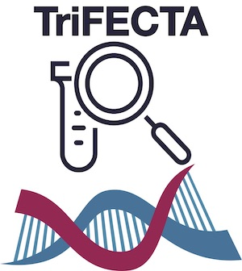

# TriFECTA

## Tri - Fantastical Emporium of Clinical Trial Assortments

{ width=50% }

## API Documentation

# What is <this software>?

Overview Diagram

# How to use <this software>

# Software Workflow Diagram

# File structure diagram 
#### _Define paths, variable names, etc_

# Installation options:

We provide two options for installing <this software>: Docker or directly from Github.

### Docker

The Docker image contains <this software> as well as a webserver and FTP server in case you want to deploy the FTP server. It does also contain a web server for testing the <this software> main website (but should only be used for debug purposes).

1. `docker pull ncbihackathons/<this software>` command to pull the image from the DockerHub
2. `docker run ncbihackathons/<this software>` Run the docker image from the master shell script
3. Edit the configuration files as below

### Installing <this software> from Github

1. `git clone https://github.com/NCBI-Hackathons/<this software>.git`
2. Edit the configuration files as below
3. `sh server/<this software>.sh` to test
4. Add cron job as required (to execute <this software>.sh script)

### Configuration

```Examples here```

# Testing

We tested four different tools with <this software>. They can be found in [server/tools/](server/tools/) . 
  
### API

There is also a Docker image for hosting the main website. This should only be used for debug purposes.

  1. `git clone https://github.com/NCBI-Hackathons/<this software>.git`
  2. `cd Website`
  3. `docker build --rm -t <this software>/website .`
  4. `docker run -t -i <this software>/website`
  
